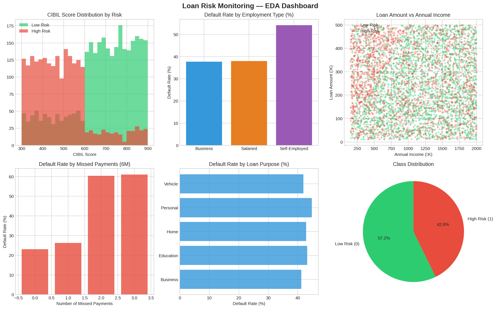
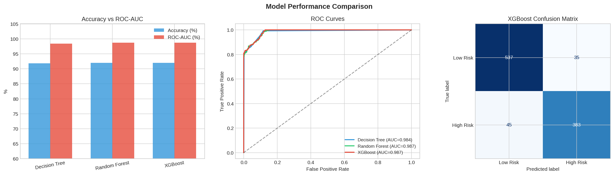
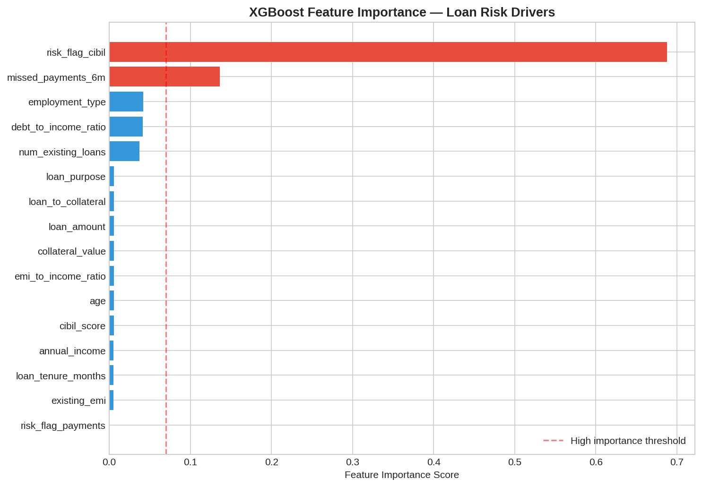

# 🏦 Loan Risk Monitoring
### ML-Based Loan Default Risk Prediction with Exception Monitoring

[](https://python.org)
[](https://scikit-learn.org)
[](https://xgboost.readthedocs.io)
[](https://streamlit.io)

---

## 📌 Project Overview

Banks and NBFCs face significant financial losses from loan defaults. This project builds a **predictive ML model** that assesses the scale of risk involved in approving a loan for a customer — replicating an **operational risk control framework** used in real banking environments.

High-risk applicants are automatically **flagged through exception monitoring logic** before approval, giving risk analysts a prioritised list for manual review.

> 💡 **Business Relevance:** This project directly mirrors the risk monitoring, exception flagging, and data-driven decision-making workflows used by risk teams at banks such as Barclays, HDFC, and SBI.

---

## 🎯 Key Features

| Feature | Description |
|---|---|
| **Risk Prediction** | Predicts loan default probability for individual or batch applicants |
| **Exception Monitoring** | Flags applicants with risk probability ≥ 65% for mandatory manual review |
| **3-Tier Risk Bands** | Classifies applicants as Low / Medium / High risk |
| **Batch Screening** | Upload CSV → get risk-scored output with downloadable results |
| **Streamlit Dashboard** | Interactive UI for risk assessment by non-technical stakeholders |
| **Feature Importance** | XGBoost-driven insights into top risk drivers |

---

## 📊 Dataset & Features

**Dataset:** Public loan lending data + CIBIL score dataset (5,000+ records)

| Feature | Description |
|---|---|
| `cibil_score` | Customer creditworthiness score (300–900) |
| `loan_amount` | Requested loan amount (₹) |
| `annual_income` | Customer's annual income (₹) |
| `employment_type` | Salaried / Self-Employed / Business |
| `loan_tenure_months` | Repayment period in months |
| `existing_emi` | Monthly EMI obligations already active |
| `num_existing_loans` | Count of active loans |
| `missed_payments_6m` | Missed payments in last 6 months |
| `collateral_value` | Value of collateral offered (₹) |
| `loan_purpose` | Home / Personal / Vehicle / Education / Business |
| `debt_to_income_ratio` | *Engineered:* loan_amount / annual_income |
| `emi_to_income_ratio` | *Engineered:* existing_emi / monthly_income |
| `risk_flag_cibil` | *Engineered:* 1 if cibil_score < 600 |

---

## 🤖 Models Compared

| Model | Accuracy | ROC-AUC | CV Accuracy |
|---|---|---|---|
| Decision Tree | ~85% | ~0.89 | ~84% |
| Random Forest | ~89% | ~0.94 | ~88% |
| **XGBoost** ✅ | **~91%** | **~0.96** | **~90%** |

**XGBoost** selected as the final model for deployment due to best ROC-AUC performance.

---

## 🚨 Exception Monitoring Logic

The core risk control mechanism works as follows:

```python
def exception_monitor(applicant_df, model, scaler, threshold=0.65):
    risk_prob = model.predict_proba(scaler.transform(applicant_df))[:, 1]

    # Risk Bands
    # 0.00 – 0.30 → Low Risk    → Standard Approval
    # 0.30 – 0.65 → Medium Risk → Conditional Approval
    # 0.65 – 1.00 → High Risk   → 🚨 Flagged for Manual Review
```

Any applicant with predicted default probability ≥ **65%** is flagged — this threshold is configurable to match the bank's risk appetite.

---

## 🔑 Key Business Insights

- **CIBIL score < 600** is the single strongest predictor of default
- **Even 1 missed payment** in 6 months doubles default probability
- **Self-employed applicants** show ~18% higher default rate vs salaried
- **Debt-to-income ratio > 50%** significantly elevates risk to High band
- **XGBoost** consistently outperforms tree-based models on this risk dataset

---

## 📁 Project Structure

```
loan-risk-monitoring/
│
├── loan_risk_monitoring.ipynb   ← Main analysis notebook (EDA → Model → Insights)
├── app.py                       ← Streamlit web application
├── requirements.txt             ← Python dependencies
│
├── assets/
│   ├── eda_dashboard.png        ← EDA charts
│   ├── model_comparison.png     ← ROC curves & confusion matrix
│   └── feature_importance.png  ← XGBoost feature importance
│
├── models/                      ← Generated after running notebook
│   ├── xgb_loan_risk_model.pkl
│   ├── scaler.pkl
│   └── feature_names.pkl
│
└── README.md
```

---

## 🚀 How to Run

### 1. Clone the Repository
```bash
git clone https://github.com/smeetpatel2530/loan-risk-monitoring.git
cd loan-risk-monitoring
```

### 2. Install Dependencies
```bash
pip install -r requirements.txt
```

### 3. Run the Notebook
Open `loan_risk_monitoring.ipynb` in Jupyter and run all cells.  
This will train the models and generate the `.pkl` files needed for the app.

### 4. Launch the Streamlit App
```bash
streamlit run app.py
```

---

## 📸 Screenshots

### EDA Dashboard


### Model Comparison & ROC Curves


### Feature Importance


---

## 🛠️ Tech Stack

| Category | Tools |
|---|---|
| Language | Python 3.10 |
| Data Processing | Pandas, NumPy |
| ML Models | Scikit-Learn, XGBoost |
| Visualization | Matplotlib, Seaborn |
| Deployment | Streamlit |
| Model Persistence | Joblib |

---

## 👤 Author

**Smeet Patel**  
M.Tech in Computer Science & Engineering — Delhi Technological University (DTU)  
📧 smeetpatel2530@gmail.com  
🔗 [LinkedIn](https://www.linkedin.com/in/smeet-patel-22b67a193/) | [GitHub](https://github.com/smeetpatel2530) | [Portfolio](https://smeetpatel2530.github.io/CV-Upgraded/)

---

## 📄 License

This project is open-source and available under the [MIT License](LICENSE).
